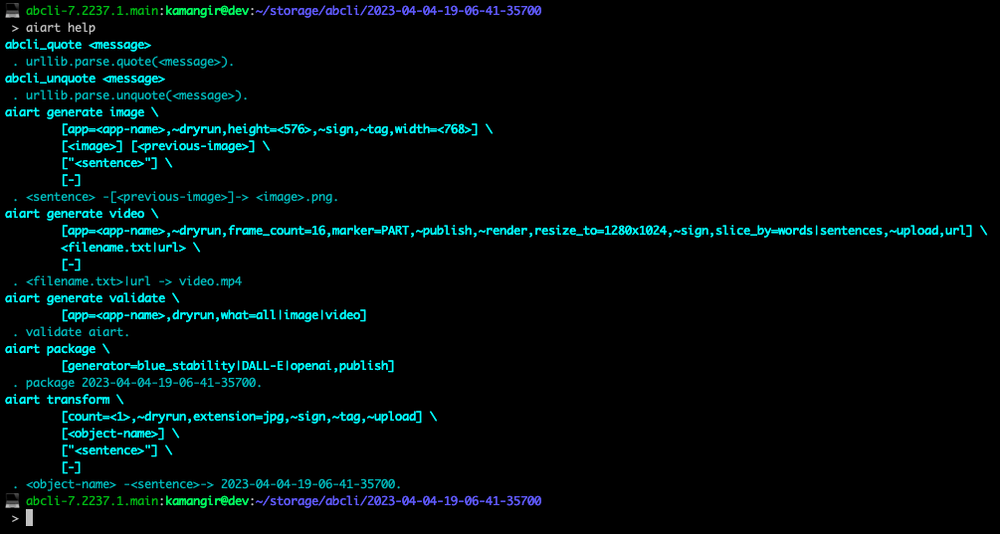

# 🎨 `aiart`

🎨 `aiart` is an interface to [OpenAI](https://github.com/kamangir/openai), [DALL-E](https://github.com/kamangir/openai/blob/main/.abcli/DALLE.sh), and [Stable Diffusion](https://github.com/kamangir/blue-stability). AiArt can ingest [text and poetry](https://github.com/kamangir/aiart/blob/main/aiart/html/functions.py) from [allpoetry.com](https://allpoetry.com/), [medium](https://medium.com/), and [poetryfoundation.org](https://www.poetryfoundation.org/).

| [Stable Diffusion](https://github.com/kamangir/blue-stability)                                   | [OpenAI](https://github.com/kamangir/openai)                                             |
| ------------------------------------------------------------------------------------------------ | ---------------------------------------------------------------------------------------- |
|  |  |
|   |   |

| [DALL-E](https://github.com/kamangir/openai/blob/main/.abcli/DALLE.sh)        |
| ----------------------------------------------------------------------------- |
|  |

an [`awesome-bash-cli`](https://github.com/kamangir/awesome-bash-cli) (`abcli`) plugin.
